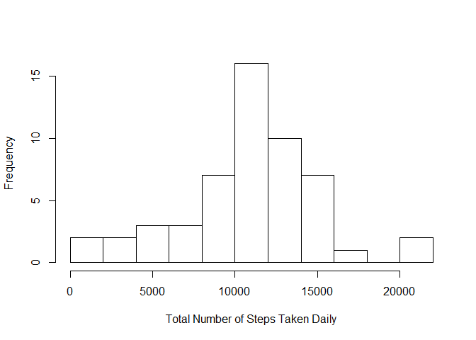
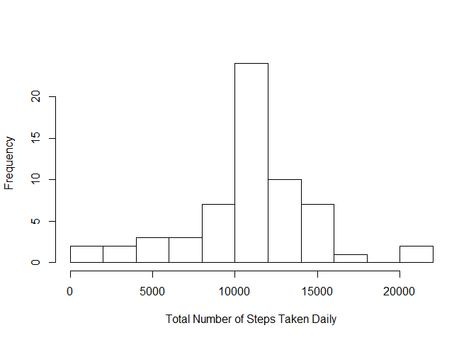
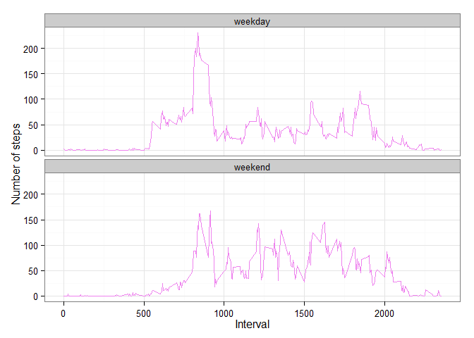

# Reproducible Research: Peer Assessment 1
Robert Davis  
Sunday, March 15, 2015  

## Executive Summary
The goal of this assignment is to use R markdown to write a report that answers the questions detailed in the sections below. A single R markdown document will be processed by knitr and will be transformed into an HTML file.

This assignment makes use of data from a personal activity monitoring device. This device collects data at 5 minute intervals through out the day. The data consists of two months of data from an anonymous individual collected during the months of October and November, 2012 and include the number of steps taken in 5 minute intervals each day. The data for this assignment can be downloaded from the course web site: Dataset: Activity monitoring data [52K] The variables included in this dataset are:

* steps: Number of steps taking in a 5-minute interval (missing values are coded as NA)
* date: The date on which the measurement was taken in YYYY-MM-DD format
* interval: Identifier for the 5-minute interval in which measurement was taken 

The dataset is stored in a comma-separated-value (CSV) file and there are a total of 17,568 observations in this dataset.


## Loading and preprocessing the data
Load input data from a zip file from the current R working directory.

```r
rdata <- read.table(unz("activity.zip", "activity.csv"), header=T, quote="\"", sep=",",
                  colClasses=c("numeric", "character", "numeric"))

## Convert the date field to Date class and interval field to Factor class.
rdata$date <- as.Date(rdata$date, format = "%Y-%m-%d")
rdata$interval <- as.factor(rdata$interval) 
```

Examine the data using str() method:


```r
str(rdata)
```

```
## 'data.frame':	17568 obs. of  3 variables:
##  $ steps   : num  NA NA NA NA NA NA NA NA NA NA ...
##  $ date    : Date, format: "2012-10-01" "2012-10-01" ...
##  $ interval: Factor w/ 288 levels "0","5","10","15",..: 1 2 3 4 5 6 7 8 9 10 ...
```

## What is mean total number of steps taken per day?
* Create a new dataset ignoring missing data NA
* Plot a histogram of the total number of steps taken each day
* Report the mean and median total number of steps taken per day


```r
stepsPerDay <- aggregate(steps ~ date, rdata, sum)
colnames(stepsPerDay) <- c("date","steps")
head(stepsPerDay)
```

```
##         date steps
## 1 2012-10-02   126
## 2 2012-10-03 11352
## 3 2012-10-04 12116
## 4 2012-10-05 13294
## 5 2012-10-06 15420
## 6 2012-10-07 11015
```

Plot histogram of the total number of steps taken each day:


```r
hist(stepsPerDay$steps, 
     main=" ",
     breaks=10,
     xlab="Total Number of Steps Taken Daily")
```

 

Report mean and median of steps:


```r
stepsMean   <- as.integer(mean(stepsPerDay$steps, na.rm=TRUE))
stepsMedian <- as.integer(median(stepsPerDay$steps, na.rm=TRUE))
```

The mean number of steps is 10766 and the median number of steps is 10765.

## What is the average daily activity pattern?
* Calculate average steps for each 5-minute interval during a 24-hour period.
* Make a time series plot of the 5-minute interval (x-axis) and the average number of steps taken, averaged across all days (y-axis).
* Report which 5-minute interval, on average across all the days in the dataset, contains the maximum number of steps.
* Observe the average daily activity pattern.

Calculate the aggregation of steps by intervals of 5-minutes and convert the intervals as integers and save them in a data frame called stepsPerInterval.


```r
stepsPerInterval <- aggregate(rdata$steps, 
                                by = list(interval = rdata$interval),
                                FUN=mean, na.rm=TRUE)
#convert to integers
stepsPerInterval$interval <- 
        as.integer(levels(stepsPerInterval$interval)[stepsPerInterval$interval])
colnames(stepsPerInterval) <- c("interval", "steps")
```

Make the plot with the time series of the average number of steps taken (averaged across all days) versus the 5-minute intervals:


```r
library(ggplot2)
ggplot(stepsPerInterval, aes(x=interval, y=steps)) +   
        geom_line(color="orange", size=1) +  
        labs(title="Average Daily Activity Pattern", x="Interval", y="Number of steps") +  
        theme_bw()
```

 

Find the 5-min interval, on average across all the days in the dataset, containing the maximum number of steps:


```r
maxInterval <- stepsPerInterval[which.max(  
        stepsPerInterval$steps),]
```

The 835the interval has maximum 206 steps.  Based on steps taken pattern, the person's daily activity peaks around 8:35am.

## Imputing missing values
Compute the total number of missing values using is.na() method.


```r
missingValues <- sum(is.na(rdata$steps))
```

The total number of missing values is 2304.

To populate missing values, the missing values are replaced with the mean value at the same interval across days.


```r
naIndex <- which(is.na(rdata$steps))
naReplace <- unlist(lapply(naIndex, FUN=function(idx){
                interval = rdata[idx,]$interval
                stepsPerInterval[stepsPerInterval$interval == interval,]$steps}))
fillSteps <- rdata$steps
fillSteps[naIndex] <- naReplace
        
rdataFill <- data.frame(  
        steps = fillSteps,  
        date = rdata$date,  
        interval = rdata$interval)
str(rdataFill)
```

```
## 'data.frame':	17568 obs. of  3 variables:
##  $ steps   : num  1.717 0.3396 0.1321 0.1509 0.0755 ...
##  $ date    : Date, format: "2012-10-01" "2012-10-01" ...
##  $ interval: Factor w/ 288 levels "0","5","10","15",..: 1 2 3 4 5 6 7 8 9 10 ...
```

Plot a histogram of the daily total number of steps taken after filling missing values.


```r
fillStepsPerDay <- aggregate(steps ~ date, rdataFill, sum)
colnames(fillStepsPerDay) <- c("date","steps")

##plotting the histogram
hist(fillStepsPerDay$steps, 
     main=" ",
     breaks=10,
     xlab="Total Number of Steps Taken Daily") 
```

 


```r
stepsMeanFill   <- as.integer(mean(fillStepsPerDay$steps, na.rm=TRUE))
stepsMedianFill <- as.integer(median(fillStepsPerDay$steps, na.rm=TRUE))
```

The mean is 10766 and median is 10766.

The values measured after adjusting for missing values differ slightly. Before filling the na data Mean = 10766 and Median = 10765. After filling the na data Mean = 10766 and Median: 10766.  The mean and median values after filling the missing data are equal.

## What is the impact of imputing missing data on the estimates of the total daily number of steps?
Comparing the calculations done with and without missing data adjustment, the mean value remains unchanged; although, the median value has shifted and matches the mean.  The impact of imputing missing values has increase our peak, but does not negatively affect our predictions.

## Are there differences in activity patterns between weekdays and weekends?
Using the table with filled-in missing values, we do the following.

1. Augment the table with a column that indicates the day of the week
2. Subset the table into two parts - weekends (Saturday and Sunday) and weekdays (Monday through Friday).
3. Tabulate the average steps per interval for each data set.
4. Plot the two data sets side by side for comparison.


```r
rdataFill$weekday <- as.factor(weekdays(rdataFill$date)) # weekdays
    
# Get week end data
weekendData <- subset(rdataFill, weekday %in% c("Saturday","Sunday"))
weekendSteps <- aggregate(weekendData$steps, by=list(interval = weekendData$interval),
                          FUN=mean, na.rm=T)
weekendSteps$interval <- as.integer(levels(weekendSteps$interval)[weekendSteps$interval])
            colnames(weekendSteps) <- c("interval", "steps")
    
# Get week day data
weekdayData <- subset(rdataFill, !weekday %in% c("Saturday","Sunday"))
weekdaySteps <- aggregate(weekdayData$steps, by=list(interval = weekdayData$interval),
                          FUN=mean, na.rm=T)
weekdaySteps$interval <- as.integer(levels(weekdaySteps$interval)[weekdaySteps$interval])
            colnames(weekdaySteps) <- c("interval", "steps")

weekendSteps$dayofweek <- rep("weekend", nrow(weekendSteps))
weekdaySteps$dayofweek <- rep("weekday", nrow(weekdaySteps))
weekdayData <- rbind(weekendSteps, weekdaySteps)
weekdayData$dayofweek <- as.factor(weekdayData$dayofweek)
```

Below you can see the panel plot comparing the average number of steps taken per 5-minute interval across weekdays and weekends:


```r
ggplot(weekdayData, aes(x=interval, y=steps)) + 
        geom_line(color="violet") + 
        facet_wrap(~ dayofweek, nrow=2, ncol=1) +
        labs(x="Interval", y="Number of steps") +
        theme_bw()
```

 

We can see in the graph above that weekday activity has the greatest peak from all step intervals. But, we can also see that weekend activities have more peaks. This is possibly due to the fact that activities on weekdays mostly follow a work related routine, where we see more intense activity in in the weekend data that may possible be from sporting activities. 

